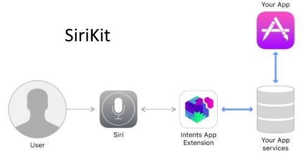

Mobile APIs

# Alexa

* [Alexa Skills Set](https://developer.amazon.com/alexa-skills-kit)

    * Alexa is Amazon’s voice service and the brain behind millions of devices like the Amazon Echo, Echo Dot, and [Echo Show](https://developer.amazon.com/echo-show). Alexa provides capabilities, or skills, that enable customers to create a more personalized experience. There are now [more than 15,000 skills](https://www.amazon.com/alexa-skills/b/ref=skillsrw_surl?ie=UTF8&node=13727921011) from companies like Starbucks, Uber, and Capital One as well as other innovative designers and developers

    * With the Alexa Skills Kit (ASK), designers, developers, and brands can build engaging skills and reach millions of customers. ASK is a collection of self-service APIs, tools, documentation, and code samples that makes it fast and easy for you to add skills to Alexa. With ASK, you can leverage Amazon’s knowledge and pioneering work in the field of voice design.

* [Alexa Voice Service](https://developer.amazon.com/alexa-voice-service)

    * Use the Alexa Voice Service (AVS) to add intelligent voice control to any connected product that has a microphone and speaker. Your customers will be able to ask Alexa to play music, answer questions, get news and local information, control smart home products, and more on their voice-enabled products.

* [Authorizing from a Companion App (Android/iOS)](https://developer.amazon.com/public/solutions/alexa/alexa-voice-service/docs/authorizing-your-alexa-enabled-product-from-an-android-or-ios-mobile-app)

    * To access the Alexa Voice Service (AVS), your Alexa-enabled product needs to obtain a Login with Amazon (LWA) access token, which is sent with each request to AVS. If your product lacks a graphical user interface (GUI), also known as headless, you do this by integrating a companion app with the LWA Mobile SDK for Android or iOS. Your companion app is responsible for obtaining an authorization code and securely transferring it to your product. Your product is responsible for using the authorization code to obtain access and refresh tokens from LWA, which are used to make calls to AVS

* Useful links

    * [8 things Alexa can't yet do](https://www.cnet.com/how-to/things-alexa-cant-do-yet/)

    * [Login with Amazon for iOS](https://developer.amazon.com/public/apis/engage/login-with-amazon/content/ios_docs)

    * [Amazon iOS SDK](https://developer.amazon.com/ios)

# SiriKit (iOS)

# 

* Adding third party extensions to Siri is very different from adding third party extensions to Alexa or Google Home. On Alexa and Google Home, the extensions are web based and run in the cloud. For Siri extensions, Apple uses native Apps that run on the device, are compiled, and usually written in Swift. [SiriKit](https://developer.apple.com/sirikit/) is the framework that developers use to allow their Apps to use Siri.

* SirKit supports so called extensions points of the following types:

    * Voice calls

    * Messaging

    * Buying and payment

    * Photos

    * Workouts

    * Ride booking

    * Checking Car Fuel level (CarPlay)

    * Visual Codes (iOS11)

    * Lists and Notes

* Useful Links

    * [Official Documentation by Apple](https://developer.apple.com/sirikit/)

    * [What’s new in Sirikit in iOS11](https://devstreaming-cdn.apple.com/videos/wwdc/2017/214bugobsy7xw94v/214/214_whats_new_in_sirikit.pdf)

    * [Tutorial for iOS11](https://martinmitrevski.com/2017/06/24/creating-lists-with-sirikit-on-ios11/)

# ARKit (iOS)

* Advice: If you have no experience with ARKit the hackathon might not be long enough to learn it. Otherwise you you already know the best links for getting started ;)

# Image Recognition (iOS)

* You can easily build computer vision machine learning features into your app. Supported features include face tracking, face detection, landmarks, text detection, rectangle detection, barcode detection, object tracking, and image registration.

* [https://developer.apple.com/documentation/vision](https://developer.apple.com/documentation/vision)

Possible use cases with Image Recognition:

* Image Analysis

    * Image Analysis can be used to find objects in an image. There are open source machine learning models that can be used to identify these objects. E.g. an image analysis can tell you that there’s a table, a plant and a person in a given image.

    * Process images: [VNCoreMLRequest](https://developer.apple.com/documentation/vision/vncoremlrequest)

    * Scene classification information: [VNClassificationObservation](https://developer.apple.com/documentation/vision/vnclassificationobservation)

    * Output image produced by image analysis request: [VNPixelBufferInformation](https://developer.apple.com/documentation/vision/vnpixelbufferobservation)

    * Collection of key-value information produced by image analysis: [VNCoreMLFeatureValueObservation](https://developer.apple.com/documentation/vision/vncoremlfeaturevalueobservation)

    * [Integrating a model](https://developer.apple.com/documentation/coreml/integrating_a_core_ml_model_into_your_app)

    * You can convert existing models to the Core ML model format (.mlmodel) or use the models for image recognition provided [here (see list below)](https://developer.apple.com/machine-learning/). Those include MobileNet, SqueezeNet, Places205-GoogLeNet, ResNet50, Inception v3, and VGG16

    * [Tutorial](https://www.raywenderlich.com/164213/coreml-and-vision-machine-learning-in-ios-11-tutorial)

* Barcode Reader

    * Let’s you detect and read barcodes / QR codes.

    * Find and recognize bar codes in an image: [VNDetectBarcodesRequest](https://developer.apple.com/documentation/vision/vndetectbarcodesrequest)

    * Get barcode information: [VNBarcodeObservation](https://developer.apple.com/documentation/vision/vnbarcodeobservation)

    * [Example](https://github.com/hansemannn/iOS11-QR-Code-Example)

* Object Detection and Tracking

    * Keep track of movements of objects

    * Track movements of a previously identified object: [VNTrackObjectRequest](https://developer.apple.com/documentation/vision/vntrackobjectrequest)

    * Get the position of an object: [VNDetectedObjectObservation](https://developer.apple.com/documentation/vision/vndetectedobjectobservation)

* Face Detection and Recognition

    * Find faces and recognize their features (such as eyes). Note: This won’t let you identify people.

    * Find faces within an image: [VNDetectFaceRectanglesRequest](https://developer.apple.com/documentation/vision/vndetectfacerectanglesrequest)

    * Find facial features (such as the eyes and mouth) in an image: [VNDetectFaceLandmarksRequest](https://developer.apple.com/documentation/vision/vndetectfacelandmarksrequest)

    * Get Information about facial features: [VNFaceObservation](https://developer.apple.com/documentation/vision/vnfaceobservation)

    * [Tutorial](https://www.thedroidsonroids.com/blog/face-and-faces-landmarks-detection-using-vision-framework-in-ios-11)

# Sensors (iOS)

For HackZurich16 we provided an example App to read all iOS device sensors:

iOS: [https://github.com/Zuehlke/hackzurich-sensordata-ios](https://github.com/Zuehlke/hackzurich-sensordata-ios)

Android: [https://github.com/Zuehlke/hackzurich-sensordata-android](https://github.com/Zuehlke/hackzurich-sensordata-android) 

# HomeKit (iOS)

* [Official Documentation](https://developer.apple.com/homekit/)

* [Support Page](https://developer.apple.com/support/homekit-accessory-protocol/)

* Apple opened [HomeKit Accessory Protocol Specification](https://developer.apple.com//homekit/specification/)

    * This document describes how to create HomeKit accessories that communicate with Apple products using the HomeKit Accessory Protocol for non-commercial purposes.

* Possible to use Siri with Homekit!

* [Simple Tutorial](https://littlebitesofcocoa.com/topics/9-tools) (works with Simulator)

* [HomeBridge](https://github.com/nfarina/homebridge) 

    * Homebridge is a lightweight NodeJS server you can run on your home network that emulates the iOS HomeKit API. It supports Plugins, which are community-contributed modules that provide a basic bridge from HomeKit to various 3rd-party APIs provided by manufacturers of "smart home" devices.

    * Since Siri supports devices added through HomeKit, this means that with Homebridge you can ask Siri to control devices that don't have any support for HomeKit at all. For instance, using just some of the available plugins, you can say:

        * *Siri, open the garage door.*

        * *Siri, turn on the coffee maker.*

        * *Siri, good morning! etc*

