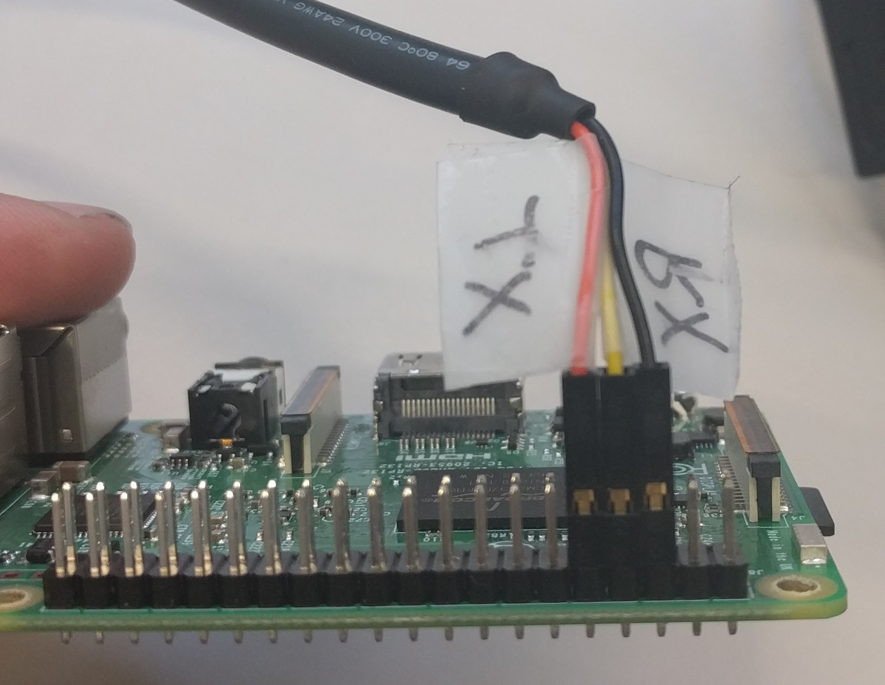

#   Raspi Setup HackZH

##  Environment
The Raspberry Pi you received is preconfigured with 'Raspian Stretch with Desktop' version 'August 2017'.
You can use the device in desktop mode (connect mouse, keyboard and a screen) or 
you can connect via SSH to the device.

### WiFi Network
The Image comes preconfigured with SSID and Password. Once the Rasperry Pi is connected to the WiFi Network it's LED will blink the IP Address.

For example the IP Adress 192.168.1.37 will be signalled as:
- *1* x slow followed by a short pause, 
- *9* x slow followed by a short pause,
- *2* x slow followed by a short pause, 
- 3 x fast for the *dot*,
- *1* x slow followed by a short pause,
- *6* x slow followed by a short pause,
- ...

To change the SSID and Password it is necessary to mount the SD card and change the settings in /etc/wpa_supplicant/wpa_supplicant.conf

### Login
Default user is `pi`, default password is `raspberry`

##  Tinkerforge (preinstalled)
https://www.tinkerforge.com

The Tinkerforge brick daemon allows you to connect to the bricks and bricklets (sensors).
In addition, the brick viewer provides a graphical interface for testing the sensors.

### Usage
- Run `Menu/Other/Brick Viewer`

### Source code and libraries
The tinkerforge website provides source code examples and libraries for
many different languages (C/C++, Java, PHP...).

The examples give a good starting point to interact with the sensors.

### Links
- Sources and libraries: https://www.tinkerforge.com/en/doc/Downloads.html
- Setup (already installed): https://www.tinkerforge.com/en/doc/Embedded/Raspberry_Pi.html

##  Node-RED (preinstalled)
https://nodered.org/

Node-RED is a programming tool for wiring together hardware devices,
APIs and online services in new and interesting ways.

It provides a browser-based editor that makes it easy to wire together flows
using the wide range of nodes in the palette that can be deployed to its runtime in a single-click.

### Usage
- Run `Menu/Programming/Node-RED` (starts the application in terminal)
- Or execute `node-red-start` via SSH
- In the webbrowser: `localhost:1880` or `http://{device-ip}:1880

### Configuration
The startup configuration of Node-RED can be changed with the file `/lib/systemd/system/nodered.service`

### Node-RED and Tinkerforge
A community project provides basic support for Tinkerforge with Node-RED:
- https://www.npmjs.com/package/node-red-contrib-tinkerforge
- https://github.com/tyrrellsystems/node-red-contrib-tinkerforge

### Links
- Getting started: https://nodered.org/docs/getting-started/
- Installation and setup: https://nodered.org/docs/hardware/raspberrypi
- Library with additional nodes and flows: https://flows.nodered.org/
- Setup (already installed): https://nodered.org/docs/hardware/raspberrypi

##  Webcam
Two applications may be used out of the box to use the webcam.

### FSWEBCAM
https://www.raspberrypi.org/documentation/usage/webcams/

Easy to use application for single image capturing.

### Motion
http://www.instructables.com/id/Raspberry-Pi-remote-webcam/

Take care, motion on the Raspberry may consume much processor power.

Motion is a nice lightweight, yet capable application for operating surveillance cameras on Linux. It works with any Linux-supported video camera, including all V4L Webcams, many IP cameras, Axis cameras, and it controls pan and tilt functions. Motion records movies and snapshots in JPEG, PPM, and MPEG formats, and you can view these remotely in a Web browser thanks to Motion's built-in HTTP server. It stores image files in a directory of your choosing, and it does not require a database, though it supports MySQL and PostgreSQL if you do want to use one.

####  Links
- Further information: https://www.linux.com/learn/how-operate-linux-spycams-motion

## Access via Serial Console
- You need an FTDI USB Cable
- Connect GND, RX, TX to the appropiate pins on the Raspberry Pi's Pin-Header
  - GND to #6
  - Rx (view from Computer) to #8
  - Tx (view from Computer) to #10
  - See picture below
- On windows connect to the serial console using e.g. PuTTY
- On windows look up the COM Port in the Device Manager
- Set the baud rate to 115200
- Connect
- Further information: http://elinux.org/RPi_Serial_Connection

