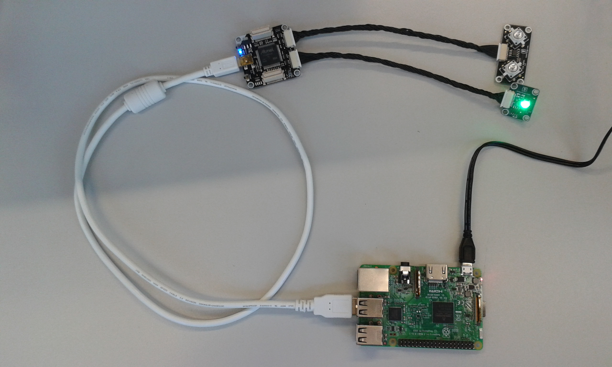
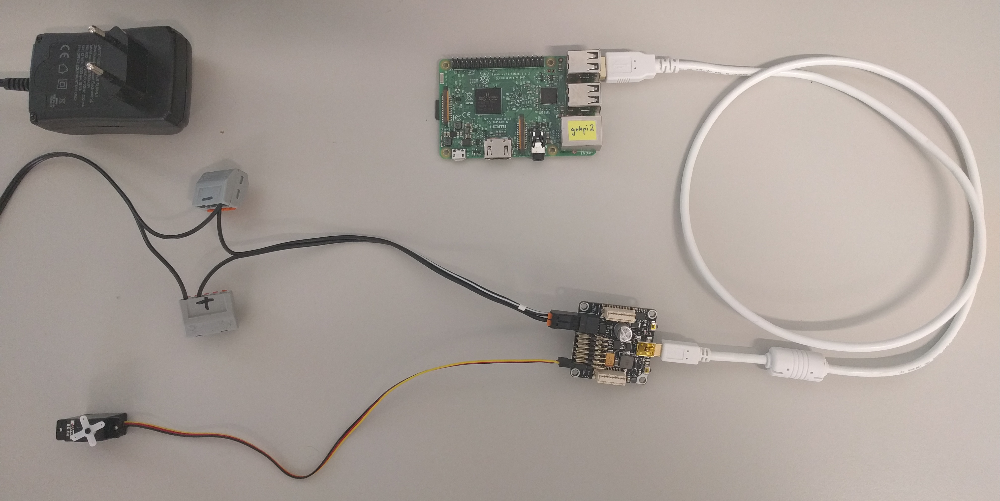
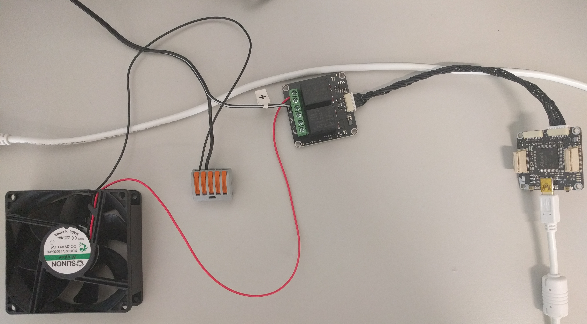

# Tinkerforge
## Brick Viewer and Brick Daemon
Install Brick Viewer and Brick Daemon on your computer using the installers from the provided USB Stick.
Further documentation: [Brick Daemon](https://www.tinkerforge.com/en/doc/Software/Brickd.html) and [Brick Viewer](https://www.tinkerforge.com/en/doc/Software/Brickv.html)

Connect Master Brick with USB to your computer. After adding/removing Bricklet you need to reconnect the USB cable for the Brick Viewer to detect changes.

## Simple Example using Raspberry Pi, Master Brick and two Bricklets
Use the following example to get familiar with the Tinkerforge hardware.
The example shows how to control the color of an LED using a button.
The following hardware components are used:
- Raspberry Pi
- Tinkerforge Master Brick
- Tinkerforge Dual Button Bricklet
- Tinkerforge RGB LED Bricklet
These components have been provided to every team of HackZurich.
The picture below shows the hardware setup:

The following steps are needed to get the example running on your Raspberry Pi:
1. Connect a Dual Button bricklet and a RGB LED bricklet to a Master Brick as shown in the picture above.
1. Connect the Master Brick to your computer using the USB cable.
1. Start the Tinkerforge Brick Viewer on your computer, select "localhost" and port 4223 in the Brick Viewer and click "Connect".
1. Write down the UID's of the Dual Button bricklet and the RGB LED bricklet shown in the Brick Viewer. These UID's are specific for your bricklets.
1. Open the JAVA project contained in the Tinkerforge/TinkerforgeExample folder with the JAVA IDE of your choice (e.g. NetBeans).
1. In the JAVA project, navigate to the TinkerforgeExample.java file and insert the bricklet UID's of your hardware at the places marked with "TODO".
1. Build the JAVA project.
1. Copy the generated file "TinkerforgeExample.jar" to your Raspberry Pi (e.g. using WinSCP).
1. Connect the Master Brick to the Raspberry Pi using the USB cable (as shown in the picture above).
1. Conncect to your Raspberry Pi using SSH and run the JAVA application on your Raspberry Pi using the following command:
    java -jar TinkerforgeExample.jar
1. Press the left button on the Dual Button bricklet several times. As a result, the LED on the RGB LED bricklet should light up in different colors.
1. Press the right button on the Dual Button bricklet. As a result, the blue LED contained in the button itself should be switched on and off.

## Setup ServoBrick
- Get a Power Supply prepared to use for the Servo Brick (Power Supply box is marked with "Servo Brick")
- Connect components like on the picture below:

- Further information about ServoBrick:  [Servo Brick Docu](https://www.tinkerforge.com/en/shop/servo-brick.html)

## Setup Relais and Fan
Connect components like on the picture below:

