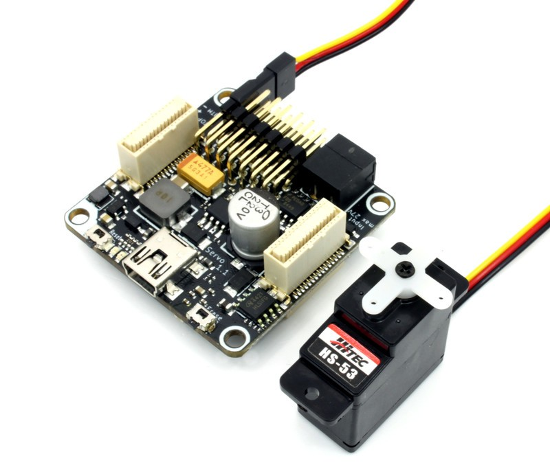
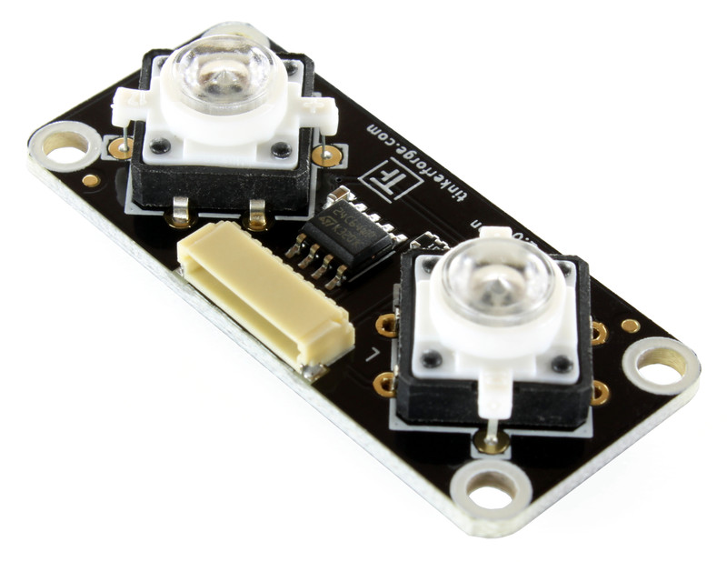
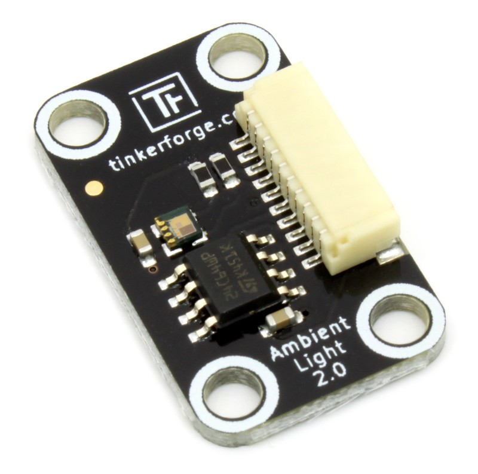

# List of provided TinkerForge components

## Basic Kit contains
* 2x MasterBrick
* 1x Temperature Bricklet
* 1x Dual Button  Bricklet
* 1x RGB LED Bricklet

## Further components available on demand
* Humidity Bricklet
* Ambient Light Bricklet 2.0
* Motion Detection Bricklet
* Barometer Bricklet
* Distance Bricklet (ultra sonic)
* Rotary Encoder Bricklet
* Dust Detector Bricklet
* NFC/RFID Reader Bricklet
* NFC Card
* Dual Relay Bricklet
* Servo Bricklet
* Servo Hitec HS-53

# Examples

ServoBrick and Hitec Servo:

Dual Button Bricklet:

Ambient Light Bricklet:

